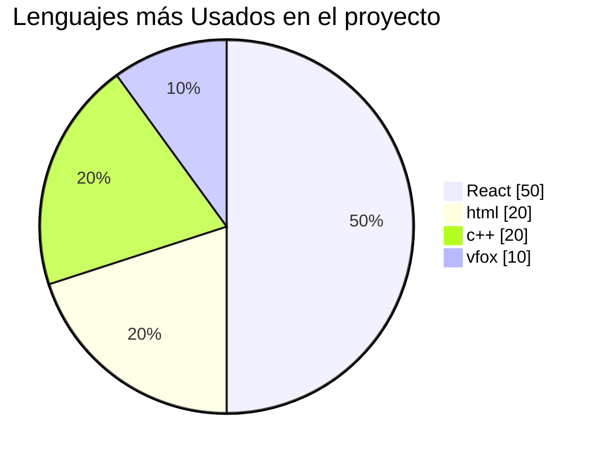
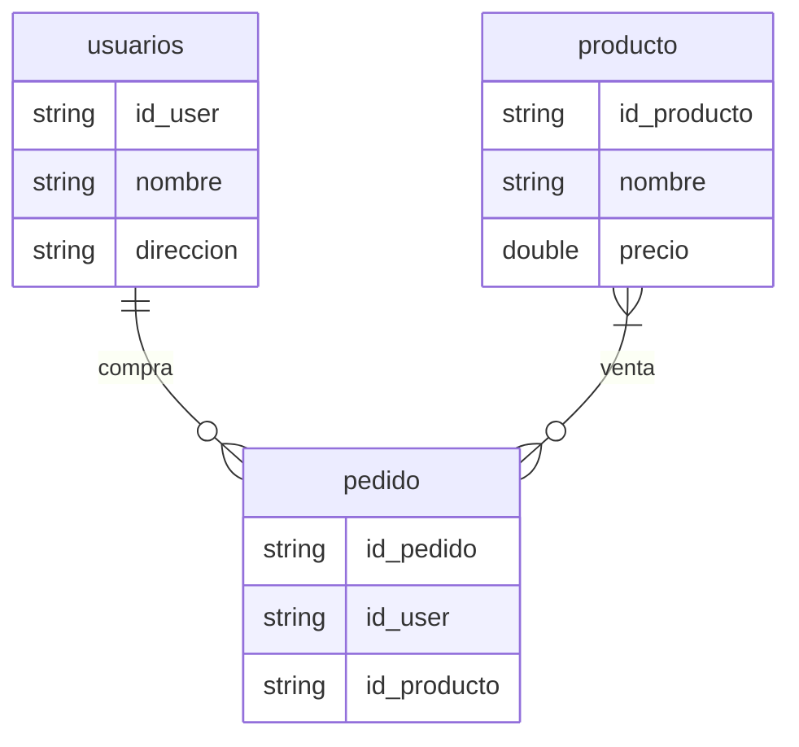
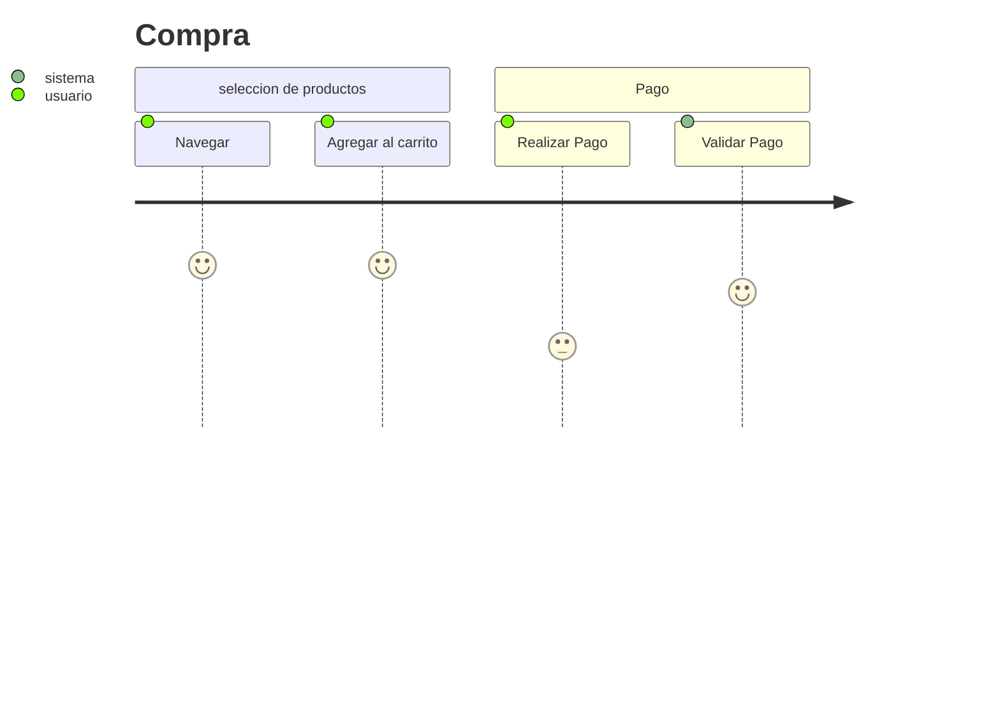
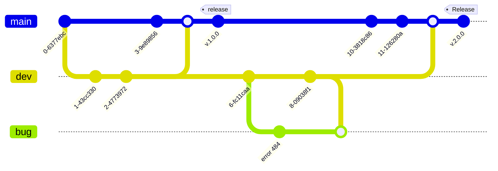
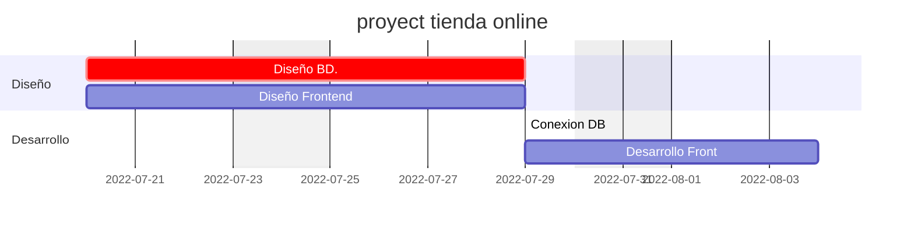

# Estudios Sobre Markdown

```
Representaremos aquellos comandos para poder 
representar los beneficios de trabajar con Markdown
```
## Título, \# usandolo
## Sub título, \## usandolo
### sub título, \### usandolo

```
la \# se usa para comentar los comandos de Markdown
```

**Negrita**,    Usandolo los *** se coloca en negrita

_Italica_ ,    \# _ se coloca en Italica

***Si quisiera tener una letra negrita y curveada***. \# Seria con ***

***Una cita, se optiene con*** \> y **
>A la vista de suficientes ojos, una falla resulta evidente **Linux Torval


```
Esta sección escribiremos un poco de código esperando que sea de su agrado para ver la prueba de las birgulillad
```
**Una lista desordenada*
 +  Primera opción
 +  Segunda opción 
    *   Caso a
    *   Caso b
 +  Tercera opción

**Una lista ordenada*
 1. Primera opción
 2. Segunda opción 
    1. Caso a
    2. Caso b
 3. Tercera opción


**Trabajaremos con Link**

Visita mi **[Perfil](www.google.com "Google")**

**Para referenciar mi correo electrónico :**
<r_trelles@hotmail.com>

**Referencias:**
Esto es una referencia [1]

[1]: https://www.google.com

**Para Cargar imagenes**
```
Se coloca el signo de !

```


**Insertando Insignias**

 


```

Una Páguina que tiene una base de Insignias
https://github.com/alexandresanlim/Badges4-README.md-Profile

https://shields.io/

```
[Link de Insignias](https://github.com/alexandresanlim/Badges4-README.md-Profile)


**6.- Reglas y Emojis, Haciendo una linea trasversal grusa**
***
salva a los panda :panda_face: :sleeping:

Link de Emoticones: [Link de emiticones](https://www.webfx.com/tools/emoji-cheat-sheet/) :grin:

**7.- Tablas**
|Cabecera 1 | Cabecera 2 | Cabecera 3|
|-----------|------------|-----------|
|asasasasssa|asasasasasas|sasasasasas|
|           |            |           |

**8.- Combinacion de MD y HTML**
Se ppueden usar etiquetas de html

**9.- Visualizacion de veideos**
[![veamos el siguiente video]](https://www.youtube.com/watch?v=1BzzckYqT9w&list=PLM4HZoZrNapsQ_f6a9275n15riyr-2AnQ&index=9 imagenalternativa.jpg](https://www.youtube.com/watch?v=1BzzckYqT9w&list=PLM4HZoZrNapsQ_f6a9275n15riyr-2AnQ&index=9)

**10.-Funciones para textos**

<ins>Texto subrrallado</ins>

<center>Texto al centro</center>

<p style="color:red"> Texto de color </p>
<p style="color:green"> Texto de color </p>

**<ins>10.1.- links</ins>**

_misma ventana_

[TESTO PARA EL lINK](https://www.google.com)

_otra ventana_

<a href="https://www.google.com" target="_blank"> TEXTO PARA LINK EN OTRA PAGUINA </a>


**11.- Manejar diagramas de flujo**


##


##

##

##

**12.- Diagrama de secuencia**


##

##

**13.- Graficas circulares**



*14.- Diagramas entidad relación*

*15.- Como crear diagramas journey*


##

*6.- Como crear un diagrama git*

====

*17.- Diagramas de Gantt*

===

*17.- Diagramas de Gantt*
```mermaid
requirementDiagram

performanceRequirement TiempoDeCarga{
    id : 1
    Text : "Tiempo de carga menor a 2 seg"
    Risk : Low
    veriFymethod: Test
}

element Carga{
    type: user_experience
    docRef : gitHub/Test
}

Carga = satisfies --> TiempoDeCarga

```
# Personalizando perfil

crear un repositorio con nuestro nombre y editar el repositorio.
